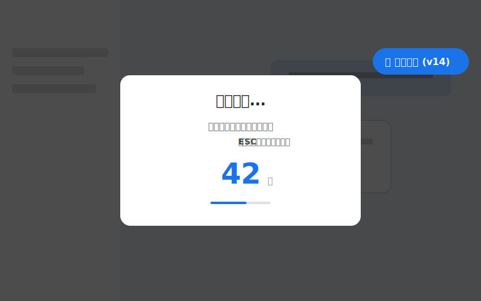

# 🚀 Google AI Studio Exporter

[English](#english) | [中文](#chinese)

<div align="center">
  
  
  <br><br>

  <!-- 浏览量徽章 -->
  
  <!-- GitHub Stars 徽章 -->
  
  <!-- License 徽章 -->
  
</div>

<span id="english"></span>

## English

### ✨ Features

This UserScript solves the problem of "Virtual Scrolling" in Google AI Studio, allowing you to export your full chat history with Gemini.

*   **🧠 Smart Auto-Scrolling**: Automatically scrolls through the chat history to load all content (solving the DOM detachment issue).
*   **🛡️ Active Detection**: Works perfectly even on fresh page loads (no manual scrolling needed).
*   **🧹 Clean Output**: Removes UI garbage (buttons, icons, "Run/Edit" text) and keeps only the dialogue.
*   **🎨 Interactive UI**: Beautiful overlay with progress tracking, countdown, and status indicators.
*   **� Text-First Export**: Prefer Markdown output; attachments are integrated as clickable links. In CSP-restricted environments, ZIP is disabled, a top banner informs the policy, and the “With Attachments” button is disabled with a hint.
*   **🔒 Safety Lock**: Prevents double-downloads and allows emergency stop via `ESC` key.

### 📦 Installation

1.  Install the **OrangeMonkey** extension.
    > ⚠️ **Note**: Tampermonkey is currently **NOT** supported.
2.  [👉 Click here to install](https://github.com/GhostXia/Google-AI-Studio-Exporter/raw/main/google-ai-studio-exporter.user.js)
3.  Open [Google AI Studio](https://aistudio.google.com/).
4.  You will see a **"🚀 Export Chat"** button on the top right.

### 📖 Usage

1.  Click the **Export Button** on the top right corner.
2.  Wait for the **3-second countdown** (Do not touch your mouse!).
3.  The script will **automatically scroll** to the top and then down to capture all messages.
4.  Once finished, a `.md` file will be downloaded automatically.
5.  Recommended: choose “📄 Text Only” for a text-first export with embedded links.

> **Tip**: Press `ESC` key at any time to stop scrolling and save what has been captured so far.

### 📝 Example Output

```text
Google AI Studio Chat History
Time: 2025/11/25 19:30:00
Count: 42
========================================

### User:
Analyze the provided code snippet.

----------------------------------------------------------------

### Gemini:
Here is the analysis of the code...
[Code block content...]
```

---

<span id="chinese"></span>

## 中文

### ✨ 功能亮点

这个脚本解决了 Google AI Studio 因“虚拟滚动”导致无法获取完整历史记录的问题。

*   **🧠 智能自动滚动**：全自动模拟滚动加载，确保抓取所有历史对话。
*   **🛡️ 主动探测机制**：v14内核，解决冷启动找不到滚动条的问题。
*   **🧹 数据清洗**：自动去除按钮、图标、引用来源等干扰信息，只保留纯净文本。
*   **🎨 交互式 UI**：带有倒计时、进度显示和状态提示的漂亮界面。
*   **� 以纯文本为主**：优先导出 Markdown；附件统一整合为可点击链接。CSP 环境禁用 ZIP，顶部横幅提示策略，模式选择界面“包含附件”按钮禁用并显示“（已合并至纯文本）”。
*   **🔒 安全机制**：防止重复下载，支持按 `ESC` 键随时中断并保存。

### 📦 安装方法

1.  安装 **OrangeMonkey** 扩展。
    > ⚠️ **注意**：暂不支持 Tampermonkey，请使用 OrangeMonkey。
2.  [👉 点击这里安装](https://github.com/GhostXia/Google-AI-Studio-Exporter/raw/main/google-ai-studio-exporter.user.js)
3.  打开 [Google AI Studio](https://aistudio.google.com/)。
4.  你会看到右上角出现一个 **"🚀 导出对话"** 按钮。

### 📖 使用指南

1.  点击右上角的 **导出按钮**。
2.  等待 **3秒倒计时**（请勿操作鼠标！）。
3.  脚本将 **自动滚动** 到顶部，然后向下滚动以抓取所有消息。
4.  完成后，会自动下载一个 `.md` 文件。
5.  建议：选择“📄 纯文本”进行以文本为主的导出，附件以链接形式整合。

> **提示**：随时按 `ESC` 键可停止滚动并保存已抓取的内容。

### 📝 导出示例

```text
Google AI Studio 完整对话记录
时间: 2025/11/25 19:30:00
条数: 42
========================================

### User:
Analyze the provided code snippet.

----------------------------------------------------------------

### Gemini:
Here is the analysis of the code...
[Code block content...]
```

---

---

## Star History

[](https://www.star-history.com/#GhostXia/Google-AI-Studio-Exporter&type=date&legend=top-left)

## 📜 License

AGPL-3.0 License
### 📎 Attachments Handling

- Due to strict site CSP policies, dynamic script injection is disabled; packaging attachments into a ZIP may be unavailable.
- The exporter now consolidates attachments into the Markdown as clickable links, e.g. `[image.jpg](https://...)` and `[file.pdf](https://...)`.
- In the mode selection UI, the “📦 With Attachments” button is disabled. Choose “📄 Text Only” to export a Markdown file with embedded links for attachments.
- Press `ESC` during packaging to cancel and save the current progress.

### 📎 附件处理说明

- 由于站点 CSP 策略严格，禁止动态脚本注入；附件打包 ZIP 在多数环境下不可用。
- 现已将附件“以链接形式”整合进 Markdown，如 `[image.jpg](https://...)`、`[file.pdf](https://...)`，点击即可访问原文件。
- 在模式选择界面，“📦 包含附件”按钮已禁用，后方显示“（已合并至纯文本）”。请选择“📄 纯文本”进行导出。
- 打包阶段可按 `ESC` 取消并保存当前进度。
